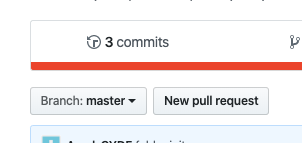
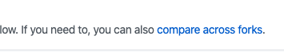

# WaaS 2주차 과제: React

두둥

## 안내사항

- 과제는 12월 30일부터 5일간 매일 게시됩니다.
- 1월 5일 0시까지 모든 과제가 완료되어 있으면 됩니다.
- 진행방식은 저번주와 똑같으며, 질문은 각 멘토에게 해주세요.

|일자|주제|링크|
|--|--|--|
|1일차 (12월 30일)|npm과 Parcel의 이해, prop|[#](https://github.com/Amel-CYDF/waas-react/tree/master/day1)|
|2일차 (12월 31일)|state와 이벤트 핸들러|[#](https://github.com/Amel-CYDF/waas-react/tree/master/day2)|
|3일차 (1월 1일)|className, 리스트, children|[#](https://github.com/Amel-CYDF/waas-react/tree/master/day3)|
|4일차 (1월 2일)|useEffect, Styled components|[#](https://github.com/Amel-CYDF/waas-react/tree/master/day4+5)|
|5일차 (1월 3일)|Todo List 리액트로 만들기|[#](https://github.com/Amel-CYDF/waas-react/tree/master/day4+5)|

## 과제 제출 방법
작업내용 확인을 위해 pull request로 과제를 제출받겠습니다.

1. 이 레포로 이동해, 'New pull request'를 누릅니다.

2. 'compare across forks'를 누릅니다.

3. base repository가 이 레포 (jungnoh/waas-react), head repository가 본인의 레포 (ex. Amel-CYDF/waas-react)이 되도록 선택합니다.
4. Create pull request를 눌러 제출을 완료합니다.
