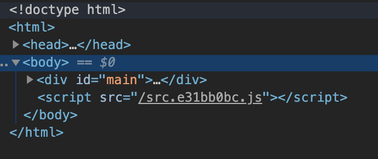

# 1일차 과제 
## 목표
- 번들러의 필요성을 이해하고, 설정된 번들러를 실행해본다.
- 리액트가 무엇인지 알아본다.
- 프롭 (prop)이 무엇인지 알아보고, 사용해본다.

> 이렇게 표시된 항목은 과제입니다.
> 질문일 경우 각자 마크다운 파일에 답을 쓰고, 과제에 함께 제출합니다.

## 수업
### 1. npm, parcel 사용해 보기
`base-name` 폴더로 이동해서 `npm i`를 실행합니다.

> `npm i`는 어떤 역할이며, `package.json`에서 어떤 부분을 읽을까요?
- npm install 의 축약 표현이며, .json 파일의 dependencies 부분을 읽어 필요한 모듈들을 설치한다.
- package-lock.json 파일은 설치할 모듈의 버전을 정확하게 명시해주는 역할을 한다.

> `npm i`로 설치한 파일은 어디에 저장될까요?
- `package.json` 파일이 저장된 폴더 하위의 node_modules 폴더에 저장된다.

`npm run dev`를 실행한 후, `localhost:1234`에 접속합니다. 아래와 같은 창이 떠야 합니다.


지금 코드에서는 React를 사용하고 있습니다. 'components/NameInput.jsx` 파일을 보면, 이런 코드가 있습니다.
```jsx
return (
  <div>님 안녕하세요.</div>
);
```
이 코드만 올라가면 브라우저가 해석할 수 없기 떄문에, 브라우저에서 실행할 수 있도록 코드를 변환시키는 과정이 필요합니다.
컴파일과 비슷한 과정이지만, 완전 binary 코드로 만드는 것이 아니라 자바스크립트 파일이 만들어집니다.

또 `localhost:1234`에서 F12 코드로 보면, js 파일 단 하나만 불러온 것을 볼 수 있습니다.
React와 같이 파일을 많이 불러오고 있지만, 코드를 변환시키는 과정에서 여러 파일이 하나로 합쳐졌습니다.



이렇게 코드를 합치고 변환하는 과정을 번들링(bundling)이라고 합니다.
번들링에 대표적으로 사용되는 툴은 Webpack, Parcel 등이 있습니다. 우리는 여기서 Parcel을 사용합니다.

> npm run dev는 어떤 역할을 하나요?
- package.json -> scripts -> dev 안의 내용을 실행하는 역할을 한다.
- `parcel src/index.html` 명령을 실행한다.

> npm run dev 처럼 서버를 실행하지 않고, 한번 빌드만 해서 `output` 폴더에 저장하고 싶습니다.
> 이런 기능을 `npm run build`로 실행하도록 `package.json` 파일에 명령을 추가하세요.
>> 힌트: [Parcel 문서](https://parceljs.org/cli.html)
- scripts 부분에 다음과 같은 코드를 추가하였다.
```javascript
  "build": "parcel build src/index.html -d output"
```

### 2. React 코드 읽어보기

리액트가 무엇인지 읽어보세요.
[강좌](https://velopert.com/3612)

> 리액트에서 많은 양의 컴포넌트를 빠르게 그리기 위해 사용하는 기술은?

리액트에서 요소를 표현할 때는 HTML을 닮은 JSX라는 형태를 사용합니다.
[이 글](https://velopert.com/3626)을 읽으면서 JSX에 대해 알아보세요.
**JSX 안에 자바스크립트 값 사용하기** 이전까지는 꼭 읽어야 합니다.

`src` 폴더의 코드를 한 파일에서 다른 파일을 불러오는 관계에 유의하면서 코드를 읽어보세요.

> `src/index.js`의 각 줄에 주석을 달아보세요. 주석이 5개가 있어야 합니다.

> `src/components/NameInput.jsx`의 9, 10번 줄에서 각 컴포넌트는 어디서 가져오는 걸까요?

> `src/components/SayHi.jsx`에서 1, 3, 9번 줄에 어떤 코드인지 설명하는 주석을 다세요.

### 3. Prop 사용해보기

`src/components/Main.jsx`에서 이렇게 코드를 사용하고 있습니다.

```jsx
<SayHi name="김명중" />
```
> name에 저장된 값 그대로 전달해서 '김명중님 안녕하세요' 라고 뜨게 코드를 바꿔봅시다.

#### 참고사항
- '김명중' 값 자체를 SayHi.jsx에 적으면 안됩니다. 즉, `name`값을 바꾸면 화면에 뜨는 값도 달라져아 합니다.
- 힌트: [React 문서](https://reactjs-kr.firebaseapp.com/tutorial/tutorial.html)