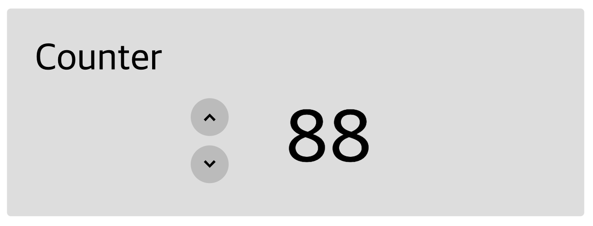
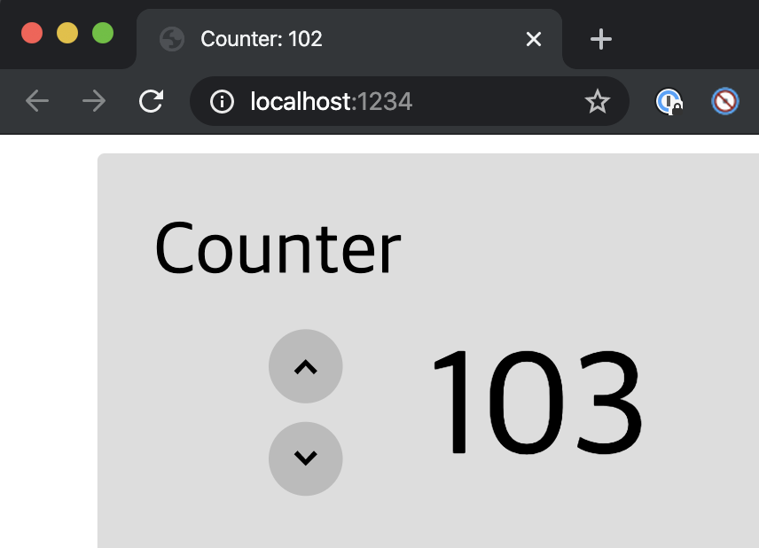
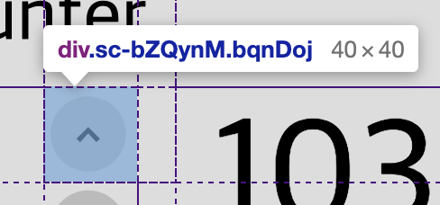

# 4+5일차 과제
## 목표
- `useEffect` hook의 용도를 이해하고 적용해 본다.
- Styled component를 사용해 본다.
- 간단한 웹페이지를 리액트로 구현해 본다.

## `useEffect` hook

`counter` 폴더로 이동해서 패키지를 설치하고, 실행해 보곘습니다. 아래와 같은 화면이 나옵니다.
 

`component/Main.jsx`를 수정해 보겠습니다.
브라우저 창 제목에 카운터 값이 나오도록 하고 싶습니다. 이를 구현하기 위해 `updateValue` 함수의 `setValue` 이후 아래 코드를 추가해 보겠습니다.
```js
document.title = `Counter: ${value}`;
```
이렇게 작성한 후 페이지를 실행해보면, 제목이 바뀌기는 하는데 뭔가 이상합니다.


제목의 변화가 한 템포 느립니다. 왜 이럴까요?

우리 눈에는 리액트에서 상태를 변화시키면 바로 반영되는 것처럼 보입니다. 하지만 실제로는 그렇지 않습니다.
컴포넌트를 새로 그리는 횟수를 줄이기 위해, 리액트의 virtual DOM이 적절하다고 판단하는 순간에 state를 업데이트합니다.
그 속도가 빨라서 우리 눈에 보이지는 않지만, 최소한 다음 줄이 실행되기 전까지는 업데이트 되지 않은 것입니다.

이렇게 state나 prop이 변할 때마다 코드를 실행시키기 위해 `useState`와 비슷한 `useEffect`가 존재합니다.

> [리액트 공식 문서](https://ko.reactjs.org/docs/hooks-reference.html#useeffect), 
> [보다 친절하지만 영어인 문서](https://ko.reactjs.org/docs/hooks-effect.html)
> 를 읽고 창 제목이 제때 업데이트 되도록 수정해 봅시다.
```js
useEffect(() => {
  document.title=`Counter: ${value}`; 
});
```


## Styled components

카운터의 CSS가 어떻게 이루어져 있는지 살펴보겠습니다.
버튼의 클래스를 보면, 뭔가 정상적인 이름이 아닙니다.


왜 이렇게 되었는지 `components/ClickButton.jsx`에서 알아보겠습니다.

> 5번 러인에서 `const {index, onClick} = props;`가 어떤 의미인지
> [문서를 읽고](https://poiemaweb.com/es6-destructuring#2-%EA%B0%9D%EC%B2%B4-%EB%94%94%EC%8A%A4%ED%8A%B8%EB%9F%AD%EC%B2%98%EB%A7%81-object-destructuring)
> 설명해 보세요.
- 객체(props)의 각 프로퍼티를 이름에 맞게 좌변 변수 리스트에 할당한다.

6번 라인부터 보면, Button이라는 변수에 CSS 속성이 왕창 저장되고, 아래 `return` 부분애서
이 값을 컴포넌트처럼 쓰고 있습니다.
이런 기능을 스타일이 들어간 컴포넌트, styled component라고 합니다.

```js
const Button = styled.div`
  width: 100%;
`;
```
이런 식으로 styled component를 정의합니다. `styled.div`라고 표현해서 CSS가 적용된 `div` 요소를 적용하고, \` \` 로 string을 만들어서 안에 CSS를 적어주면 됩니다.

이렇게 디자인을 적용하면 어떤 장점이 있을까요? 우선, JS 파일에 CSS를 포함할 수 있어
컴포넌트에 대한 정의를 한 파일에 담을 수 있습니다.
디자인과 컴포넌트 정의가 연결되어서 코드를 관리하기 훨씬 편해집니다.
또, CSS 클래스명이 꼬일 일이 없습니다.
CSS 파일에서 `.class-name {}` 형태로 디자인을 정의하면,
그 속성은 페이지 내 모든 `.class-name` 요소에 적용됩니다.
프로그래밍 언어로 따지면 모든 변수를 전역 변수로 선언해버리는 것과 같습니다.
이런 특징이 때론 장점이 될 수 있겠지만, `container`와 같이 자주 쓰이는 단어의 클래스 명은
자칫하면 꼬일 수 있습니다.
Styled component는 위에서 봤듯이 난수로 클래스명을 지정해주기에 그런 걱정이 없습니다.

부수적인 효과로, JS 코드의 변수를 CSS로 집어넣을 수 있습니다. 10번 라인의 코드를 보면 prop으로
전달된 `index` 값으로 `grid-row` 속성을 지정해 주고 있는 것을 볼 수 있습니다.

> `ClickButton.jsx`를 참고해서,
> `Main.jsx`의 `<div className="container">`의 디자인을
> CSS 컴포넌트로 바꿔보세요.
- [Main.jsx](https://github.com/regitiger98/waas-react/blob/master/day4%2B5/counter/src/components/ClickButton.jsx)

### 참고사항
- Styled component는 리액트의 기능이 아닙니다.
`styled-components` 패키지를 별도로 설치해야 하고,
`ClickButton.jsx`에서도 `styled`를 import하고 있습니다.
- Visual Studio Code를 사용중이라면
[플러그인](https://marketplace.visualstudio.com/items?itemName=jpoissonnier.vscode-styled-components)을 설치해 보세요.
Styled component 안의 CSS를 예쁘게 표시해줍니다.
- [Styled component 문서](https://www.styled-components.com/docs/basics#getting-started)

## 리액트로 페이지 만들어 보기
여러분은 이제 리액트의 기초 기능들은 모두 사용해 보았습니다. 와!!!👏👏👏👏

이번주의 강좌를 마무리하면서, 
오프라인 강좌에서 진행한 [할 일 목록 만들기](https://codepen.io/jungnoh/full/LYEZvyN)를 리액트로 만들어 보겠습니다.

필요한 컴포넌트들의 구조와 디자인은 `todo`폴더에 대부분 구현되어 있습니다. 여러분이 하셔야 할 일은
- 컴포넌트들을 props, state로 연결짓기
- 배열에서 요소를 넣고 빼기
- [Main.jsx](https://github.com/regitiger98/waas-react/blob/master/day4%2B5/todo/src/components/Main.jsx)


### 참고사항
- 조금 어려울 수 있지만, 리액트를 어떻게 접근해야 하는지에 관한
[공식 문서](https://ko.reactjs.org/docs/thinking-in-react.html)를
읽어보세요.
- (힌트) 배열애서 요소를 제거할 때는
[splice 함수](https://developer.mozilla.org/ko/docs/Web/JavaScript/Reference/Global_Objects/Array/splice)를
사용해보세요.
- 오프라인 강좌에서 사용한 코드를 참고해가면서 작업하세요. 단, DOM을 직접 조작하지는 말아야 합니다!
- 완성해지 못해도 괜찮으니, 일요일까지 최대한 구현해 보세요.
